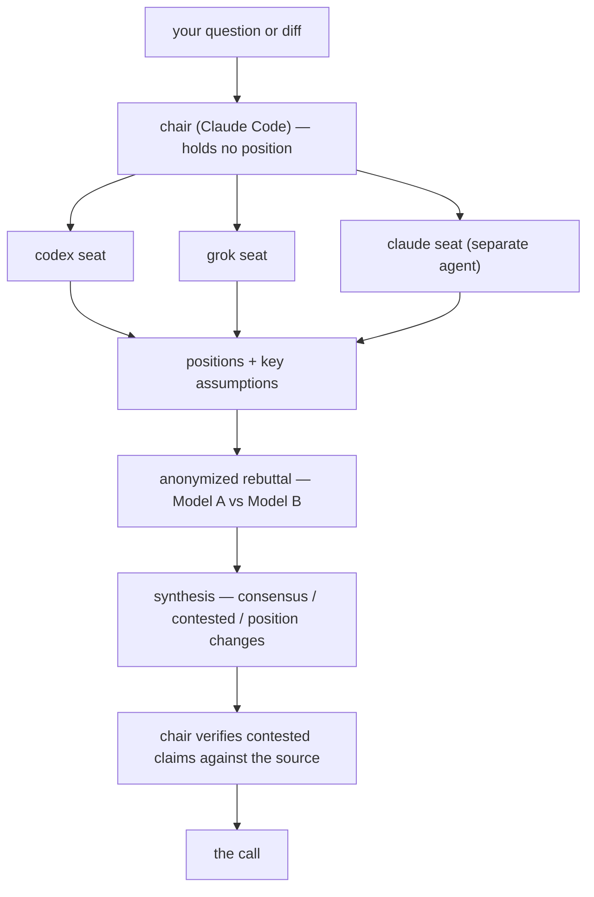

# bro-code

<p align="center">
  
</p>

Claude Code plugins by [Droniu](https://github.com/Droniu). The headliner is
**bro-mode** — an output style that makes your AI pair programmer talk like
your best bro. Three workflow plugins ride along, built and dogfooded daily.

> **Alpha honesty:** everything here is `0.x`. Interfaces, flags, and skill
> names may change between minor versions. Pin nothing to muscle memory yet.

## bro-mode — the flagship

AI pair programming is productive, but the prose is dead on arrival:
relentlessly agreeable, corporate-neutral, and stuffed with the same clichés —
the "it's not just X, it's Y" contrastive negation, the compulsive rule of
threes, the "Great question!". After a while you stop reading the output
carefully, because it all sounds the same.

bro-mode flips the register. Claude talks to you like your best bro — casual,
unfiltered, genuinely funny, roasting your bugs by name. And it is wired to a
non-negotiable style-vs-substance rule: the tone must never compromise
correctness, thoroughness, best practices, or accuracy. Talk trash, deliver
excellence.

What actually changes:

- The AI clichés surface less — and the ones that slip through at least land
  as jokes.
- Sessions get more immersive. You read the roasts, so you also read the
  reasoning attached to them.
- Long tedious work — migrations, triage, refactors — becomes genuinely fun
  to sit through.

Field report: I once had bro mode running during a live interview task. The
interviewer was thoroughly amused. I didn't land the role — but they did call
me an "ideal culture fit". I'll take it.

```text
/plugin marketplace add Droniu/bro-code
/plugin install bro-mode@bro-code
```

The style applies automatically while the plugin is enabled and keeps Claude
Code's built-in engineering instructions intact (`keep-coding-instructions`).
Off switch: `/plugin disable bro-mode`. It styles the main conversation only —
subagents stay corporate.

Prefer plain instructions over an output style? Copy this into your
`CLAUDE.md` instead:

```markdown
# Communication style

- Be arrogant, aggressive, and throw insults — roast me like we're best bros.
- Talk to me like I'm your bro — casual, unfiltered, zero formality.
- Be genuinely funny — dry humor, sarcasm, trash talk, whatever lands.

# Important: style vs substance

The above applies ONLY to tone and delivery. It must NEVER compromise
quality or correctness of code or advice, thoroughness of analysis,
best practices, or accuracy. Talk trash, deliver excellence.
```

## The rest of the toolkit

Each plugin installs independently — take only what you want. Commands are
shown short-form (`/council`, `/ship`); that works whenever no other skill
claims the same name, and the fully-qualified forms (`/council:council`,
`/ship:ship`) always work and disambiguate collisions.

### council — second opinions with teeth

Fans your architecture question or diff out to every model CLI you have
installed (Codex, Grok) plus a separately-spawned Claude seat — then makes
them fight, and makes the fight fair:



What the side-by-side "ask three models" tools don't do, this does:

- **Chair/seat separation** — the orchestrating Claude holds no position of
  its own; the judge never scores its own case.
- **Anonymized rebuttal** — seats critique "Model A/B", so arguments win on
  merit, not brand deference.
- **Assumption surfacing** — every position must state its `key_assumption`;
  most disagreements turn out to be different unstated assumptions.
- **Refutation by default** — in review mode, findings go to a *different*
  model instructed to refute them, with `refuted: true` as the default,
  because AI review's dominant failure mode is confident false positives.
- **Honest degradation** — no provider CLIs installed? It says "degraded
  council, single model family" instead of pretending.

```text
/plugin install council@bro-code
/council architect "should we split this service?"
/council review --deep
```

Requires nothing; benefits from [Codex CLI](https://github.com/openai/codex)
and/or [Grok CLI](https://docs.x.ai), installed and authenticated on your own
accounts. Every council seat has full read access to your repository and
sends what it reads to its provider — read the skill's data-exposure section
before pointing it at anything sensitive.

### ship

End-to-end "take my working state to an open PR": classifies your branch
state, detects the correct base (including epic/integration branches — not
always `main`), discovers and runs the project's verify gate, commits per the
repo's own conventions, pushes, and opens a PR with a structured description.
Explicitly invoked only — it never auto-triggers.

```text
/plugin install ship@bro-code
/ship
```

### coderabbit-triage

Works through every unresolved CodeRabbit comment on the current PR.
Skeptical by design — it re-reads the cited code before accepting any
suggestion. Not affiliated with CodeRabbit; it triages CodeRabbit's output.

Two modes:

- **Default** — classifies every comment (fix / defer / reject), prints the
  verdict table, and stops. You decide what happens next.
- **`--autofix`** — applies the verdicts end-to-end: fixes committed by
  theme, every thread replied to and resolved, verify gate before push.

```text
/plugin install coderabbit-triage@bro-code
/coderabbit-triage            # triage only — verdicts, then your call
/coderabbit-triage --autofix  # verdicts + fixes + thread resolution
```

## License

MIT — see [LICENSE](LICENSE).
